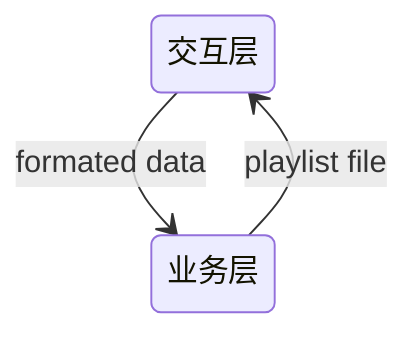

# 整体流程
```flow
st=>start: 开始
in_lib=>inputoutput: 选择音乐库
o_scan=>operation: 扫描路径文件
c_newLib=>condition: 新数据库?
in_rule=>inputoutput: 定义生成规则
o_updateLib=>operation: 更新数据
o_generate=>operation: 生成playlist
e=>end: 结束
st->in_lib->o_scan->c_newLib
c_newLib(yes)->in_rule
c_newLib(no)->o_updateLib->in_rule
in_rule->o_generate->e
```
# 模块组成
整体模块分为 __交互层__ 和 __业务层__ 两组

__交互层__ 用户交互/用户本地环境交互
__业务层__ 数据接收/数据处理/数据持久化/数据输出


***
## 任务清单
### 开发任务 
#### 交互层 
> 最终产出： 一个UI交互端
> 任务清单
> 1. 整体UI设计 √
> 2. 主页面
> 2.1 UI实现 √
> 2.2 交互事件代码实现 
> 2.3 文件夹下音乐文件扫描/数据格式化

#### 业务层 doing

> 最终产出： UI侧所需服务接口
> 任务清单
> 1. 核心逻辑模块
> 1.1 服务协议定义 √
> 1.2 核心业务对象设计及逻辑实现 √  
> 2. 基础设施模块
> 2.1 核心层repository实现 √
> 2.2 自动配置 √
> 3. 自动配置模块
> 3.1 自动配置 √

### 部署任务
> 最终产出： 一个可在windows下执行的程序包
> 1. 项目打包成独立jar
> 2. JRE环境整合